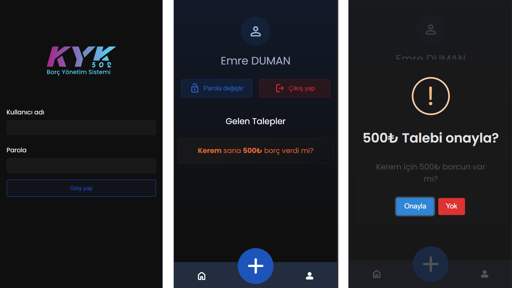
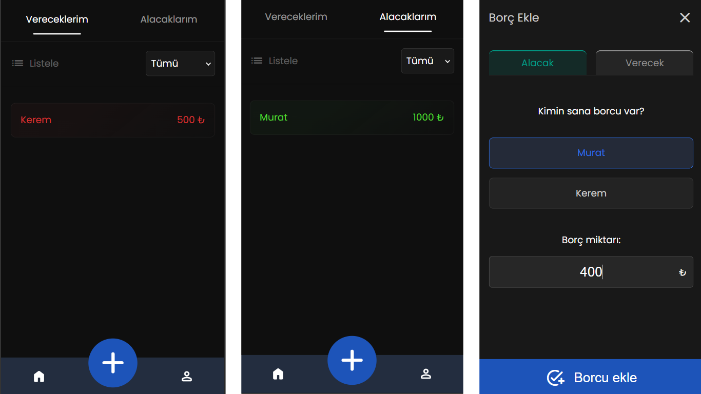

# Borç Takip (KYK502 - BYS)

Arkadaş grubunuzla birbirinize olan borçlarınızı takip etmek için geliştirilmiş bir web uygulamasıdır. 

## Özellikler

- Mobil cihazlar için tasarlanmış bir arayüze sahiptir.
- Progressive Web App (PWA) olarak cihaza indirilebilir.
- Kayıt olmak için özel bir menü bulunmamaktadır. Kayıtlı kullanıcılar, server tarafından bir script yardımıyla eklenir. Kullanıcılar, uygulama arayüzünden giriş yaparak sisteme erişebilirler.
- Sisteme kayıtlı kullanıcılara alacak veya verecekleri borçları ekleyebilirler.
- Kullanıcıya göre alacak veya verecek borçları, filtreleme seçeneği ile birlikte görüntüleyebilirler.
- Başka birisinden alacak borç eklemeye veya verecek borcunuzu silmeye çalıştığınızda, işlem doğrudan gerçekleşmez. Karşı taraftaki kullanıcının onaylaması gerekir.
- Hesaba bir kere giriş yaptıktan sonra, server tarafından hesap oluşturulurken girilen şifreyi değiştirebilirler.

## Kullanılan Teknolojiler

- Node.js ve Express.js: Uygulama bu teknolojiler kullanılarak geliştirilmiştir.
- EJS: Sayfa renderları için EJS kullanılmıştır.
- MySQL ve Sequelize: Veritabanı için MySQL ve Sequelize ORM kullanılmıştır.

## Daha Sonra Eklenecek Özellikler

- Admin paneli
- IBAN kopyalama

## Gereksinimler

- Node.js
- MySQL Server

## Kurulum

Uygulamayı kullanabilmek için öncelikle gerekli bileşenlerin kurulumunu yapmalısınız. Bunun için aşağıdaki adımları izleyebilirsiniz:

1. Projeyi klonlayın:

```bash
git clone https://github.com/emredumaan/borc-takip
```

2. Proje dizinine gidin:

```bash
cd borc-takip
```

3. Gerekli paketleri yükleyin:

```bash
npm install
```

4. Veritabanını oluşturmak ve kullanıcıları eklemek için setup komutunu çalıştırın:

```bash
node setup.js setup
```

5. Kullanıcıları oluşturmak için create-user komutunu çalıştırın:

```bash
node setup.js create-user
```

6. Uygulamayı başlatın:

```bash
npm start
```

Artık uygulamayı kullanmaya başlayabilirsiniz. Tarayıcınızdan `http://localhost:3000` adresine giderek uygulamaya erişebilirsiniz.

## Ekran Görüntüleri



